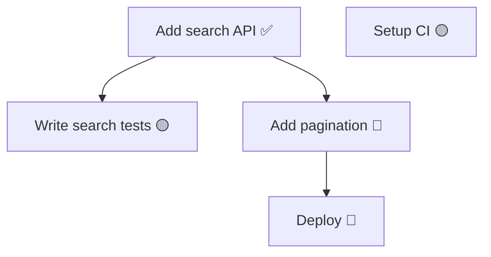

Hiển thị dependency graph.

## Execution

Chạy script:
```bash
python .claude/hooks/python/task-graph.py $ARGUMENTS
```

Nếu user yêu cầu mermaid, thêm flag `--mermaid`. Hiển thị stdout output cho user.

## Fallback (nếu script không tồn tại)

1. Đọc `.claude/memory/task_tracker.yaml`
2. Build graph từ `blocks`/`blocked_by` relationships
3. Output 2 format:

### Text format (default)
```
## 📊 Task Dependency Graph

tsk-a1b2 [Add search API] ✅ closed
  └── blocks → tsk-c3d4 [Write search tests] 🟡 open (READY)
  └── blocks → tsk-e5f6 [Add pagination] 🔴 in_progress
      └── blocks → tsk-g7h8 [Deploy] 🔵 blocked

tsk-i9j0 [Setup CI] 🟡 open (READY, no deps)

Legend: ✅ closed | 🟡 open | 🔴 in_progress | 🔵 blocked
```

### Mermaid format (khi user yêu cầu hoặc argument có `--mermaid`)


## Lưu ý
- Tasks không có dependency hiển thị riêng ở cuối (standalone)
- Command này KHÔNG thay đổi state, chỉ đọc
- Nếu không có tasks: "Task tracker rỗng."
- Nếu không có dependencies: hiển thị flat list thay vì graph
