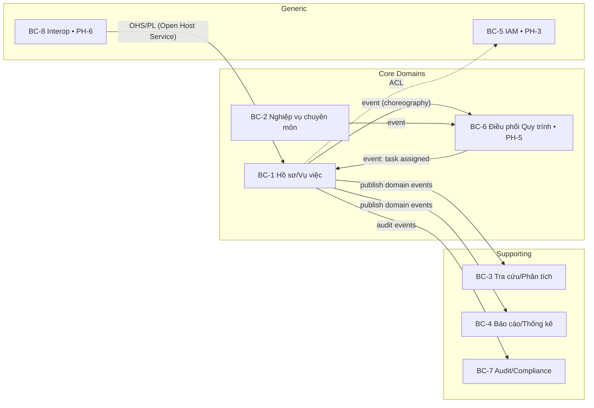
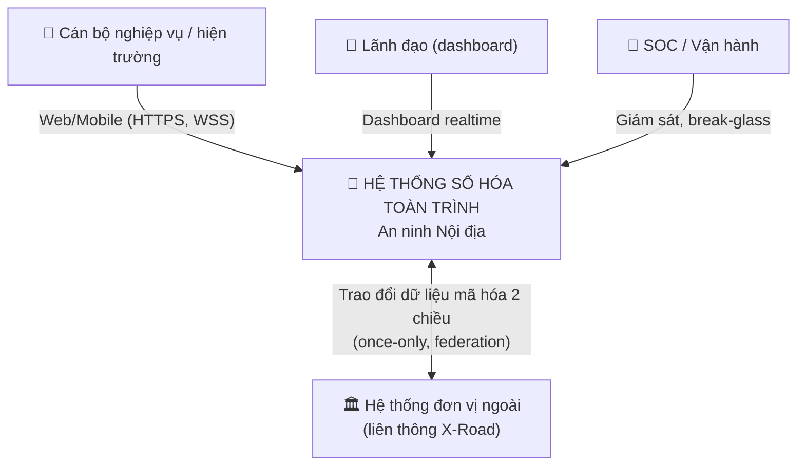
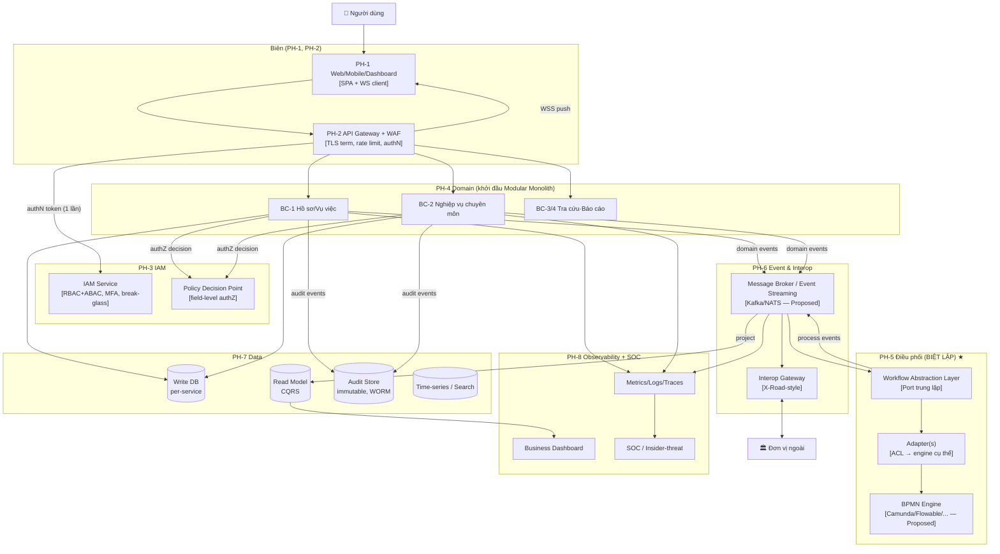
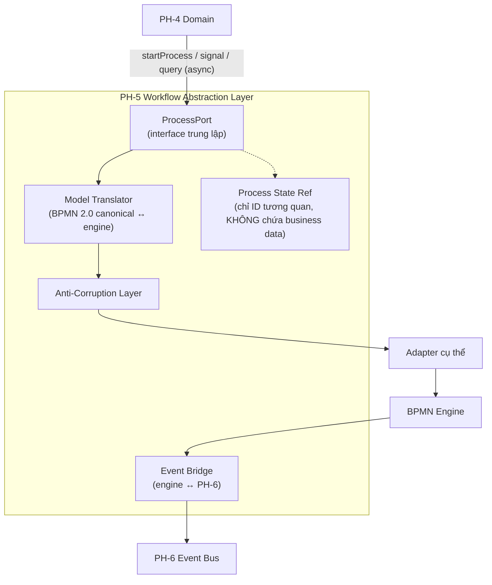

# 03 — Domain Model & C4 Model

> **Hai đầu ra M1:** (a) **Context map** từ Event Storming/DDD — cơ sở để tách microservice sau này;
> (b) **C4 model L1/L2/L3** — living diagram (Mermaid) thay cho sơ đồ ASCII trong reference architecture.
> C4 = Context → Container → Component → Code (ở đây làm 3 tầng đầu; Code sinh ở M3+).

---

## 1. Bounded Contexts & Context Map (DDD)

### 1.1 Danh mục bounded context (khởi đầu — sẽ chốt qua Event Storming ở M1)

| BC | Bounded Context | Trách nhiệm lõi | Kiểu quan hệ | Map tới |
|----|-----------------|-----------------|--------------|---------|
| **BC-1** | Quản lý Hồ sơ/Vụ việc | Vòng đời hồ sơ, vụ việc | Core Domain | PH-4 |
| **BC-2** | Nghiệp vụ chuyên môn | Xử lý nghiệp vụ đặc thù ngành | Core Domain | PH-4 |
| **BC-3** | Tra cứu & Phân tích | Truy vấn, phân tích dữ liệu | Supporting | PH-4, PH-7 |
| **BC-4** | Báo cáo & Thống kê | Tổng hợp, báo cáo | Supporting | PH-4, PH-8 |
| **BC-5** | Định danh & Truy cập (IAM) | Ai là ai, ai được làm gì | Generic (mua/OSS) | PH-3 |
| **BC-6** | Điều phối Quy trình | Trạng thái tiến trình BPMN | **Core (chiến lược)** | PH-5 |
| **BC-7** | Audit & Compliance | Nhật ký bất biến, bằng chứng | Supporting | PH-7 |
| **BC-8** | Liên thông (Interop) | Trao đổi dữ liệu liên đơn vị | Generic (X-Road-style) | PH-6 |

### 1.2 Context map — kiểu quan hệ tích hợp (DDD strategic patterns)

> **Quy tắc quan hệ then chốt (giải xung đột X6):** BC-6 (workflow) và các Core domain giao tiếp
> **chỉ bằng event choreography**, không command đồng bộ hai chiều. Đây là điều kiện để engine "tháo lắp được".
> BC-6 dùng **Anti-Corruption Layer** để không cho ngữ nghĩa engine cụ thể rò rỉ vào domain (ADR-001).

---

## 2. C4 Level 1 — System Context

**Ranh giới hệ thống:** dữ liệu **không ra khỏi biên giới** (REQ-S-011); liên thông với đơn vị ngoài
qua tầng interop chuẩn hóa, **không** gom dữ liệu về kho trung tâm (REQ-F-009).

---

## 3. C4 Level 2 — Container Diagram

**Điểm kiến trúc đọc từ sơ đồ:**
- Engine BPMN (`eng`) **không bao giờ** được domain gọi trực tiếp — luôn qua `wal → adp` (REQ-F-002).
- Đường realtime: `domain → bus → project → rdb → WSS → web` (giải X3: tổng hợp qua event vào read model).
- Token verify **1 lần** tại `gw` (ADR-007) → downstream không lặp lại (giải X1).

---

## 4. C4 Level 3 — Component: Workflow Abstraction Layer (PH-5)

> Chi tiết interface & hợp đồng ở [`04_ph5-workflow-abstraction-layer.md`](04_ph5-workflow-abstraction-layer.md).
> Đây là **container chiến lược nhất** nên là container đầu tiên được vẽ tới L3.

**Ba bất biến của L3 (kiểm bằng FIT-007 & FIT-010):**
1. `domain` chỉ import `ProcessPort`, **không** import SDK engine.
2. `state` chỉ giữ **correlation id / process instance id**, không giữ dữ liệu nghiệp vụ (REQ-F-003).
3. Mọi giao tiếp domain↔engine đi qua `Event Bridge` (async), không call đồng bộ (REQ-F-004).

---

## 5. Ánh xạ C4 ↔ Phân hệ ↔ REQ (truy vết)

| Container | Phân hệ | REQ chính | ADR |
|-----------|---------|-----------|-----|
| Web/Dashboard | PH-1 | REQ-F-006, F-012, N-003 | ADR-012 |
| API Gateway+WAF | PH-2 | REQ-S-001, S-010 | ADR-007 |
| IAM + PDP | PH-3 | REQ-S-002..005 | ADR-007 |
| Domain services | PH-4 | REQ-F-005, F-008, F-011 | ADR-002, 005, 006 |
| **Workflow Abstraction** | **PH-5** | **REQ-F-001..004, O-006** | **ADR-001, 011** |
| Event bus + Interop | PH-6 | REQ-F-004, F-009, F-010 | ADR-003, 009 |
| Write/Read/Audit store | PH-7 | REQ-F-007, F-013, S-008 | ADR-004, 008, 010 |
| Observability + SOC | PH-8 | REQ-N-009, S-012 | — |
