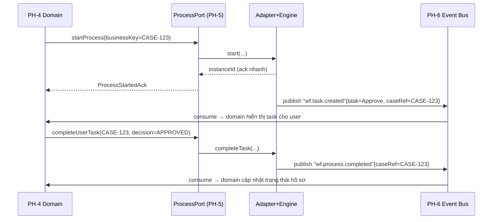

# 04 — PH-5 Workflow Abstraction Layer (Lõi chiến lược)

> Đây là **thành phần quan trọng nhất** của toàn dự án: tên project là `bpmn2.0-workflow-engine-platform`,
> và cả reference architecture lẫn RAID log đều đánh dấu "khóa cứng workflow engine" là **rủi ro cốt lõi**.
> Tài liệu này đặc tả *interface trung lập + adapter contract + tiêu chí tháo lắp* để biến khẩu hiệu
> "tháo lắp được" thành hợp đồng kỹ thuật kiểm chứng được (FIT-010).
>
> Trace: **REQ-F-001, F-002, F-003, F-004, O-006** · **ADR-001, ADR-011** · giải xung đột **X6, X8**.

---

## 1. Ba điều kiện "tháo lắp được" (nâng lên thành hợp đồng)

Reference architecture §4 PH-5 nêu 3 điều kiện. Tôi nâng mỗi điều kiện thành **ràng buộc kiểm chứng được**:

| # | Điều kiện | Ràng buộc kỹ thuật (contract) | Kiểm chứng |
|---|-----------|-------------------------------|-----------|
| C1 | Chuẩn hóa BPMN 2.0 ở mức định nghĩa | Định nghĩa quy trình lưu dạng **BPMN 2.0 XML canonical**; adapter chịu trách nhiệm nạp vào engine. Không dùng extension độc quyền của 1 engine ở tầng canonical. | Lint BPMN + import lên ≥2 engine |
| C2 | Tách bạch dữ liệu | Engine chỉ giữ **process state + correlation keys**; **0 byte business data** trong engine store. | FIT-007 (static scan) + schema review |
| C3 | Giao tiếp hướng sự kiện | Domain ↔ engine chỉ qua **event bus async**; không call đồng bộ, không shared DB. | FIT-007 + ArchUnit rule |

> **Định lý tháo lắp:** đủ C1 ∧ C2 ∧ C3 ⇒ đổi engine = viết lại **chỉ** Adapter, domain bất biến.
> FIT-010 chứng minh định lý này liên tục bằng cách chạy cùng bộ contract test trên ≥2 adapter.

---

## 2. Hexagonal view — Port & Adapter

```
            ┌───────────────────── PH-4 DOMAIN (business core) ─────────────────────┐
            │  chỉ biết ProcessPort — KHÔNG biết engine nào đứng sau                 │
            └───────────────┬───────────────────────────────────────────────────────┘
                            │ (1) driving port
              ┌─────────────▼──────────────┐
              │   ProcessPort  (interface)  │   ◄── hợp đồng trung lập, ổn định
              └─────────────┬──────────────┘
                            │
        ┌───────────────────┼─────────────────────────────┐
        │        WORKFLOW ABSTRACTION LAYER (PH-5)          │
        │  ┌──────────┐  ┌───────────────┐  ┌───────────┐  │
        │  │Translator│  │Anti-Corruption│  │EventBridge│  │
        │  │BPMN⇄canon│  │    Layer      │  │engine⇄bus │  │
        │  └────┬─────┘  └──────┬────────┘  └─────┬─────┘  │
        └───────┼───────────────┼─────────────────┼────────┘
                │ (2) driven port (SPI)            │
        ┌───────▼────────┐ ┌────▼─────────┐  ┌─────▼──────┐
        │ CamundaAdapter │ │FlowableAdapter│ │CustomAdapter│  ◄── thay 1 cái = thay engine
        └───────┬────────┘ └────┬─────────┘  └─────┬──────┘
                ▼               ▼                   ▼
          Camunda 8        Flowable            Engine tự xây
```

- **Driving port** (`ProcessPort`): domain gọi vào — API mà nghiệp vụ thấy.
- **Driven port / SPI** (`EngineAdapter`): PH-5 gọi ra engine — API mà mỗi engine phải hiện thực.

---

## 3. Đặc tả `ProcessPort` (driving port — hợp đồng domain thấy)

Ngôn ngữ mô tả là **trung lập** (pseudo-interface); khi chốt stack (M2) sẽ hiện thực bằng ngôn ngữ đã chọn.

```text
interface ProcessPort:

  # --- Lifecycle (bất đồng bộ: trả về ack + correlationId, kết quả về qua event) ---
  startProcess(cmd: StartProcessCommand) -> ProcessStartedAck
  signalProcess(cmd: SignalCommand) -> Ack            # gửi tín hiệu/message vào tiến trình
  completeUserTask(cmd: CompleteTaskCommand) -> Ack   # hoàn thành 1 human task
  cancelProcess(cmd: CancelCommand) -> Ack

  # --- Query (đọc trạng thái tiến trình — chỉ metadata, KHÔNG business data) ---
  getProcessState(q: ProcessInstanceRef) -> ProcessStateView
  listActiveTasks(q: TaskQuery) -> TaskView[]

  # --- Definition management ---
  deployDefinition(bpmnXml: CanonicalBpmn) -> DeploymentResult
```

### 3.1 Kiểu dữ liệu trung lập (canonical DTO — không mang dấu vết engine)

```text
StartProcessCommand:
  processDefinitionKey : string        # khóa BPMN canonical (vd "case.investigation.v3")
  businessKey          : string        # correlation key trỏ về hồ sơ domain (KHÔNG phải dữ liệu)
  variables            : map<string, ProcessVariable>   # CHỈ biến điều phối (trạng thái, cờ, id)
  initiator            : ActorRef      # cho audit (REQ-S-008)
  tenantId             : string        # phân vùng đơn vị chủ quản

ProcessVariable:                       # ràng buộc: primitive/enum/ref — KHÔNG blob nghiệp vụ
  type  : SCALAR | ENUM | ENTITY_REF   # ENTITY_REF = con trỏ tới business data ở PH-4, không phải bản thân data
  value : ...

ProcessStateView:
  instanceId     : string
  definitionKey  : string
  status         : RUNNING | SUSPENDED | COMPLETED | CANCELLED | INCIDENT
  currentTasks   : TaskView[]
  startedAt/updatedAt : timestamp
  # KHÔNG có field nào chứa nội dung hồ sơ
```

> **Ràng buộc C2 hiện thực ở đây:** `variables` chỉ nhận `SCALAR | ENUM | ENTITY_REF`.
> `ENTITY_REF` là **con trỏ** (`{domain: "case", id: "..."} `) — dữ liệu thật ở PH-4. Một static rule
> (FIT-007) cấm truyền payload nghiệp vụ (vd JSON hồ sơ) vào `variables`.

---

## 4. Đặc tả `EngineAdapter` (driven port / SPI — mỗi engine phải hiện thực)

```text
interface EngineAdapter:
  deploy(bpmn: CanonicalBpmn) -> EngineDeploymentId
  start(defKey, businessKey, vars) -> EngineInstanceId
  signal(instanceRef, signal) -> void
  completeTask(taskRef, vars) -> void
  cancel(instanceRef) -> void
  fetchState(instanceRef) -> EngineState        # adapter dịch EngineState → ProcessStateView
  subscribeEngineEvents(handler) -> Subscription # engine phát event → EventBridge → PH-6

  # Bắt buộc: adapter tự dịch mọi lỗi engine → CanonicalProcessError (ACL)
```

**Trách nhiệm Anti-Corruption Layer (ACL):** dịch **2 chiều** giữa mô hình canonical và mô hình engine —
lỗi, trạng thái, tên biến, kiểu task. Không cho enum/exception/tên đặc thù engine lọt lên `ProcessPort`.

---

## 5. Mô hình sự kiện (Event Bridge ↔ PH-6) — giải X6

Engine **không** đứng trên đường request đồng bộ nóng. Vòng đời điển hình (choreography):



**Sự kiện chuẩn hóa (canonical, không mang tên engine):**
`wf.process.started` · `wf.task.created` · `wf.task.completed` · `wf.process.completed` ·
`wf.process.incident` · `wf.process.cancelled`. Mỗi event mang `caseRef`/`businessKey` để domain correlate.

---

## 6. Tiêu chí lựa chọn & đánh giá engine (đầu vào Gate G2)

> SA **không** né quyết định. Dưới đây là **ma trận tiêu chí có trọng số** — điểm điền sau khi PoC (M2).
> Trạng thái hiện tại: khung đánh giá `Proposed`; ADR-011 ghi quyết định.

| Tiêu chí | Trọng số | Camunda (7/8) | Flowable | Tự xây | Ghi chú đánh giá |
|----------|:--------:|:-------------:|:--------:|:------:|------------------|
| Ghép vào Abstraction Layer (adapter dễ?) | 20% | _PoC_ | _PoC_ | _PoC_ | tiêu chí #1 của dự án |
| Tuân thủ BPMN 2.0 (không extension khóa cứng) | 15% | | | | ảnh hưởng C1 |
| Chủ quyền số / OSS kiểm soát được (REQ-O-006) | 15% | | | | tránh vendor lock-in |
| Hỗ trợ on-prem / air-gap (REQ-S-011) | 15% | | | | bắt buộc cho hệ mật |
| Hiệu năng & scale (REQ-N-002) | 10% | | | | |
| Chín muồi / cộng đồng / hỗ trợ | 10% | | | | rủi ro vận hành |
| Tách state (không ép chứa business data) | 10% | | | | ảnh hưởng C2 |
| Tổng chi phí sở hữu (license + vận hành) | 5% | | | | |

**Khuyến nghị sơ bộ của SA (chưa chốt — chờ PoC):** ưu tiên **OSS chín muồi (Camunda/Flowable)** cho
lần triển khai đầu vì (a) chủ quyền số + air-gap, (b) rút ngắn thời gian tới walking skeleton. "Tự xây"
chỉ chọn nếu PoC chứng minh cả hai OSS không đáp ứng ràng buộc air-gap/độ mật — vì tự xây một BPMN engine
đúng chuẩn là rủi ro schedule rất cao. Quyết định cuối **phải qua bằng chứng PoC**, không qua slide (Gate G2).

---

## 7. Chiến lược kiểm thử tháo lắp (Engine-Swap) — bằng chứng sống

| Test | Nội dung | Khi nào |
|------|----------|---------|
| **Contract test suite** | 1 bộ test viết theo `ProcessPort`, độc lập engine | M2 trở đi |
| **FIT-010** | Chạy contract suite trên ≥2 adapter → cả 2 xanh | Pre-release |
| **Engine-swap drill** | M8: thay engine A→B trong staging, chỉ đổi adapter + config, chạy lại toàn bộ contract + E2E | Định kỳ (M8) |

> Đây là hiện thực của yêu cầu cốt lõi & RAID mitigation "khóa cứng workflow engine": nếu engine-swap drill
> chạy xanh mà **không** chạm code domain → kiến trúc đã chứng minh giá trị. Nếu phải sửa domain → C1/C2/C3
> đã bị vi phạm ở đâu đó → điều tra ngay (Hard Stop kiến trúc).

---

## 8. Anti-patterns bị cấm (guardrail cho đội implement)

- ❌ Domain import trực tiếp SDK/annotation của engine (vi phạm C3, chặn bởi FIT-007).
- ❌ Nhồi JSON hồ sơ nghiệp vụ vào process variable (vi phạm C2).
- ❌ Query business data từ engine store (engine chỉ giữ process state).
- ❌ Gọi đồng bộ request→engine→response trên đường nóng của user (vi phạm X6/REQ-N-003).
- ❌ Dùng BPMN extension độc quyền ở tầng canonical (vi phạm C1, khóa cứng ngầm).
