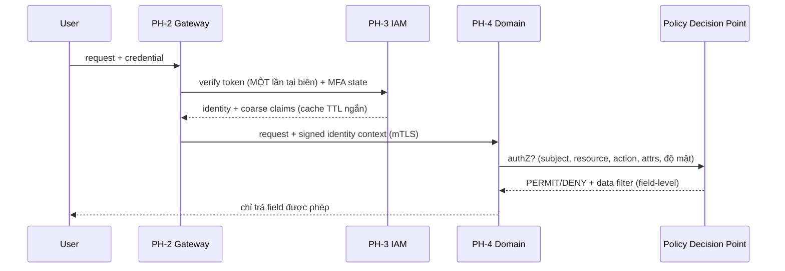

# 05 — Security Architecture & Threat Model (STRIDE)

> Security là **yêu cầu hàng đầu** của hệ thống an ninh quốc gia. Tài liệu này gồm 2 phần:
> (A) **Kiến trúc bảo mật** — Zero Trust + Defense in Depth theo tầng; (B) **Threat model STRIDE**
> với `TM-###` truy vết về REQ-S và biện pháp giảm thiểu. Đầu vào cho Gate G1 (threat model v1) & G6 (pentest).

---

## A. Kiến trúc bảo mật

### A.1 Defense in Depth — các lớp phòng thủ

```
Lớp 0  Vật lý / mạng    │ air-gap tùy cấp độ, dữ liệu trong biên giới (REQ-S-011)
Lớp 1  Biên (PH-2)      │ WAF, rate limit, TLS termination, mTLS nội bộ (REQ-S-010)
Lớp 2  Danh tính (PH-3) │ Zero Trust, MFA, RBAC+ABAC, session mgmt (REQ-S-001..003)
Lớp 3  Ứng dụng (PH-4)  │ field-level authZ (PDP), input validation, SoD/4-eyes (REQ-S-002,004)
Lớp 4  Dữ liệu (PH-7)   │ mã hóa at-rest, phân loại độ mật, audit bất biến (REQ-S-006,008,009)
Lớp 5  Vận hành (PH-8)  │ SOC, insider-threat detection, break-glass có dấu vết (REQ-S-005,012)
Xuyên  Secret/Key       │ vault tập trung, xoay khóa, không hardcode (REQ-S-007)
```

### A.2 Zero Trust flow — token verify 1 lần, phân quyền lặp lại theo ngữ cảnh



> **Giải xung đột X1:** *xác thực* token nặng chỉ làm **1 lần** tại gateway; *phân quyền* (nhẹ, cache được)
> làm lại theo ngữ cảnh ở PDP. Không lặp lại xác thực nặng downstream → giữ NFR realtime (§02 latency budget).

### A.3 Kiểm soát dữ liệu nhạy cảm

| Kiểm soát | Cơ chế | REQ |
|-----------|--------|-----|
| Phân quyền mức trường | PDP trả data filter; domain lọc field theo độ mật của subject | REQ-S-002 |
| Nguyên tắc bốn mắt | Command nhạy cảm → tạo approval task (2 actor khác nhau) qua PH-5 | REQ-S-004 |
| Break-glass | Vai trò khẩn cấp có TTL, phát `audit.breakglass.used` bất biến + cảnh báo SOC realtime | REQ-S-005 |
| Audit bất biến | WORM store, append-only, hash-chain; tách khỏi business data | REQ-S-008, ADR-008 |
| Retention vs audit | Business data có retention/hủy; audit giữ lâu dài (ẩn danh hóa thay vì xóa) | X5, ADR-008 |

---

## B. Threat Model — STRIDE

Phạm vi: các trust boundary chính (User→Gateway, Gateway→Domain, Domain→Engine, Domain→Data, Interop→ngoài).
Xếp hạng rủi ro sơ bộ: **C**=Cao / **TB**=Trung bình / **T**=Thấp (sẽ tinh chỉnh với threat modeling workshop M1).

| ID | Loại (STRIDE) | Mối đe dọa | Trust boundary | Rủi ro | Giảm thiểu | Trace |
|----|---------------|-----------|----------------|:------:|-----------|-------|
| **TM-001** | **S**poofing | Giả mạo danh tính người dùng/hệ thống | User→GW | C | MFA bắt buộc + mTLS nội bộ + token ngắn hạn | REQ-S-001,003,010 |
| **TM-002** | **S**poofing | Đơn vị ngoài giả danh qua interop | Interop | C | Xác thực 2 chiều + chữ ký + allowlist đơn vị | REQ-F-010, S-001 |
| **TM-003** | **T**ampering | Sửa nội dung request/message | GW→SVC, bus | C | TLS/mTLS + message signing trên event bus | REQ-S-006 |
| **TM-004** | **T**ampering | Sửa/xóa nhật ký kiểm toán để phi tang | SVC→Data | C | WORM + hash-chain append-only, tách quyền ghi | REQ-S-008, ADR-008 |
| **TM-005** | **R**epudiation | Phủ nhận đã thực hiện thao tác nhạy cảm | SVC | C | Audit bất biến gắn actor + bốn mắt + break-glass trace | REQ-S-004,005,008 |
| **TM-006** | **I**nfo Disclosure | Rò rỉ dữ liệu mật ra ngoài biên giới | Data, Interop | C | Mã hóa at-rest/in-transit + data-in-border + phân loại độ mật | REQ-S-006,009,011 |
| **TM-007** | **I**nfo Disclosure | Over-fetch: user thấy field vượt quyền | SVC→User | C | Field-level authZ tại PDP (không lọc ở client) | REQ-S-002 |
| **TM-008** | **I**nfo Disclosure | Business data rò rỉ qua process variable của engine | Domain→Engine | TB | Ràng buộc C2 (chỉ ref, không data) + FIT-007 | REQ-F-003 |
| **TM-009** | **D**oS | Quá tải gateway/service | User→GW | C | Rate limit + WAF + autoscale + bulkhead + broker đệm | REQ-S-010, N-006,007 |
| **TM-010** | **E**levation | Leo thang đặc quyền qua lỗ hổng authZ | SVC, PH-3 | C | ABAC least-privilege + SoD + review policy + pentest M6 | REQ-S-002,004 |
| **TM-011** | **E**levation (Insider) | Người trong có quyền hợp pháp lạm dụng | Toàn hệ | C | Insider-threat detection + SoD + break-glass + giám sát hành vi | REQ-S-004,005,012 |
| **TM-012** | **T**ampering (Supply) | Chèn mã độc qua pipeline/dependency | CI/CD | TB | DevSecOps: SAST/DAST/SCA + ký artifact + IaC review | REQ-O-001 |

### B.1 Ưu tiên xử lý (theo rủi ro C trước)

Nhóm rủi ro **Cao** phải có kiểm soát *đã kiểm chứng* trước Gate G6 (không được là "kế hoạch"):
TM-001..007, TM-009, TM-010, TM-011. Mỗi kiểm soát có 1 test tương ứng (pentest case hoặc fitness fn).

### B.2 Liên kết với milestone
- **M1:** threat model v1 (bảng này) + phân loại độ mật + chốt cấp độ NĐ 85/2016.
- **M4:** SAST/DAST mỗi increment; cập nhật threat model theo domain mới.
- **M6:** pentest bên thứ 3 độc lập phủ toàn bộ TM-### rủi ro Cao; kiểm thử break-glass/SoD/bốn mắt thật.
