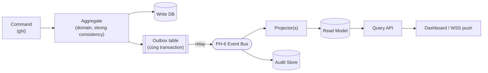

# 06 — Data Architecture (Quản trị dữ liệu PH-7)

> Chi tiết hóa PH-7 của reference architecture: **CQRS + Event Sourcing (chọn lọc) + Polyglot Persistence
> + Data Mesh + phân loại độ mật + retention**. Hiện thực các ADR-004 (CQRS), ADR-008 (audit tách biệt),
> ADR-010 (polyglot/DB-per-service) và các REQ-F-007,008,013 · REQ-S-008,009 · REQ-N-008.
> Đây là nơi 3 xung đột dữ liệu **X2 (CAP), X3 (tổng hợp phân tán), X5 (audit vs retention)** được giải trọn.

---

## 1. Nguyên tắc dữ liệu nền tảng

| # | Nguyên tắc | Hệ quả thiết kế | Trace |
|---|-----------|-----------------|-------|
| DP1 | **Dữ liệu do đơn vị chủ quản sở hữu** — không kho trung tâm | Data Mesh, mỗi BC là 1 data product | P3, REQ-F-009 |
| DP2 | **Ghi/đọc tách biệt** | CQRS: write model chuẩn hóa, read model tối ưu truy vấn | ADR-004, REQ-F-007 |
| DP3 | **Đúng công cụ cho đúng việc** | Polyglot persistence, DB-per-service | ADR-010 |
| DP4 | **Sự kiện là nguồn sự thật cho domain trọng yếu** | Event Sourcing chọn lọc → audit trail tự nhiên | REQ-S-008, X5 |
| DP5 | **Mật độ kiểm soát theo độ mật** | Data classification lái encryption/authZ/retention | REQ-S-009 |
| DP6 | **Bất biến cho bằng chứng, khả hủy cho nghiệp vụ** | Tách audit store khỏi business store | ADR-008, X5 |

---

## 2. Mô hình lưu trữ Polyglot (bản đồ kho dữ liệu)

| Kho | Loại (Proposed) | Mục đích | Consistency | Chủ sở hữu | Trace |
|-----|-----------------|----------|-------------|-----------|-------|
| **Write DB** | RDBMS (PostgreSQL) | Nguồn sự thật giao dịch domain | Strong | mỗi service | ADR-010, REQ-F-013 |
| **Event Store** | Append-only log (RDBMS/EventStoreDB) | Lịch sử sự kiện domain trọng yếu | Strong (append) | domain ES | DP4, REQ-S-008 |
| **Read Model** | RDBMS đọc / Document / Cache | Truy vấn nhanh, dashboard | Eventual | projector | ADR-004, REQ-F-007 |
| **Audit Store** | WORM / append-only + hash-chain | Nhật ký bất biến, bằng chứng | Strong, immutable | audit service | ADR-008, REQ-S-008 |
| **Search** | Search engine (OpenSearch) | Tra cứu toàn văn, phân tích | Eventual | BC-3 | REQ-F (tra cứu) |
| **Time-series** | TSDB (Prometheus/Timescale) | Metrics giám sát kỹ thuật | Eventual | PH-8/NT-5 | REQ-N-009 |
| **Cache** | In-memory (Redis) | Multi-level cache, phiên tạm | Best-effort | tầng đọc | REQ-N-008 |

> **Ràng buộc DB-per-service (ADR-010):** không service nào truy cập DB của service khác trực tiếp.
> Chia sẻ dữ liệu = qua event (publish) hoặc API (Open Host Service), không JOIN xuyên service.

---

## 3. CQRS — đường ghi và đường đọc



### 3.1 Transactional Outbox (bắt buộc — chống mất/trùng event)
Ghi vào `Write DB` và ghi bản ghi event vào bảng **Outbox trong CÙNG một transaction** (atomic); một
relay đọc outbox → publish lên bus. Giải quyết dual-write problem giữa DB và message broker.

| Guarantee | Cơ chế |
|-----------|--------|
| Không mất event | Outbox atomic với write; relay retry tới khi ack |
| Không xử lý trùng (idempotent) | Consumer dùng `eventId` + dedup key; projection idempotent |
| Thứ tự trong 1 aggregate | Partition key theo `aggregateId` trên bus |

### 3.2 Projection & lag
- Projector tiêu thụ event → cập nhật read model; **idempotent** (replay an toàn).
- **Projection lag** là metric giám sát (REQ-N-009); ngưỡng cảnh báo gắn với latency budget (§02).
- Rebuild read model = replay từ event store/bus (khả năng phục hồi, hỗ trợ RPO thấp).

---

## 4. Event Sourcing (chọn lọc — không toàn hệ thống)

> **Quyết định phạm vi:** ES **chỉ áp dụng cho domain trọng yếu** (vụ việc, phê duyệt, thao tác nhạy cảm),
> nơi *lịch sử = bằng chứng*. Domain CRUD đơn giản dùng state-oriented + audit event thường (tránh over-engineering).

| Tiêu chí áp ES | Áp ES? |
|----------------|:------:|
| Cần lịch sử đầy đủ mọi thay đổi làm bằng chứng pháp lý | ✅ |
| Quy trình phê duyệt/điều tra nhiều bước | ✅ |
| Dữ liệu tham chiếu tĩnh (danh mục, cấu hình) | ❌ (CRUD thường) |
| Read-heavy đơn giản | ❌ |

**Lợi ích ghép với audit (X5, ADR-008):** với domain ES, chuỗi event *tự thân* là audit trail; audit store
tập trung vào metadata thao tác (ai, khi nào, break-glass) + hash-chain toàn cục để chống phi tang (TM-004).

**Snapshotting:** để tránh replay dài, tạo snapshot định kỳ theo số event/aggregate.

---

## 5. Data Mesh — mỗi Bounded Context là một Data Product

| Thuộc tính Data Product | Yêu cầu | Trace |
|-------------------------|---------|-------|
| Discoverable | Đăng ký trong data catalog nội bộ | DP1 |
| Addressable | Endpoint/topic chuẩn (Open Host Service) | REQ-F-010 |
| Trustworthy | SLA chất lượng + schema versioned | REQ-O-004 |
| Self-describing | Schema + độ mật gắn kèm | REQ-S-009 |
| Interoperable | Chuẩn hóa để liên thông (xem [`08`](08_interoperability-xroad.md)) | REQ-F-009,010 |
| Secure by default | Phân loại độ mật + authZ mức trường | REQ-S-002,009 |

> **Data Mesh giải X3:** không kho trung tâm, nhưng dashboard tổng hợp toàn cục **qua event** → read model
> chuyên cho dashboard. Dữ liệu gốc vẫn phân tán tại đơn vị chủ quản.

---

## 6. Phân loại độ mật & lái kiểm soát (REQ-S-009)

| Cấp độ mật (Proposed) | Ví dụ | Encryption | AuthZ | Retention | Liên thông ra ngoài |
|-----------------------|-------|-----------|-------|-----------|---------------------|
| **MẬT / TỐI MẬT** | Hồ sơ điều tra nhạy cảm | at-rest + field-level + key riêng | ABAC chặt + bốn mắt | dài, ẩn danh khi hết hạn | ❌ / air-gap |
| **HẠN CHẾ** | Dữ liệu nghiệp vụ nội bộ | at-rest + in-transit | RBAC+ABAC | theo chính sách | có kiểm soát |
| **NỘI BỘ** | Danh mục, cấu hình | in-transit | RBAC | theo chính sách | có kiểm soát |
| **CÔNG KHAI** | Thông tin công bố | in-transit | — | — | ✅ |

> Phân loại là **thuộc tính ABAC** đầu vào cho PDP (xem [`05` §A.2](05_security-and-threat-model.md)):
> quyết định truy cập/lọc trường phụ thuộc độ mật của dữ liệu × clearance của subject. Cấp độ tổng thể
> hệ thống chốt theo **NĐ 85/2016 (cấp 4/5)** tại Gate G1 (REQ-S-011).

---

## 7. Retention & vòng đời dữ liệu (giải X5)

```
Business data:  [Active] → [Archived] → [Anonymized hoặc Purged]  (theo retention policy)
Audit metadata: [Append-only WORM] ──────────────► giữ lâu dài, BẤT BIẾN (không purge)
                                    ▲
        khi business data bị hủy, audit vẫn giữ dấu vết (ẩn danh tham chiếu thay vì xóa)
```

| Quy tắc | Nội dung | Trace |
|---------|----------|-------|
| Tách vòng đời | Business data có retention/hủy; audit giữ lâu dài | ADR-008, X5 |
| Ẩn danh thay xóa | Khi phải hủy mà cần giữ dấu vết → anonymize | ADR-008 |
| Bất biến audit | WORM + hash-chain, tách quyền ghi khỏi app | TM-004, REQ-S-008 |
| Legal hold | Tạm dừng hủy khi có yêu cầu pháp lý | REQ-S-011 |

---

## 8. Nhất quán & tương tranh (giải X2, X7)

| Chủ đề | Quyết định | Trace |
|--------|-----------|-------|
| Đường ghi giao dịch | **Strong consistency** trong 1 aggregate/service | REQ-F-013, X2 |
| Đường đọc / dashboard | **Eventual consistency** (chấp nhận trễ ms) | ADR-004, X2 |
| Liên service | **Saga + compensation**, không 2PC | ADR-005, X4 |
| Cập nhật đồng thời | **Optimistic concurrency** (version check) | ADR-006, X7 |
| Idempotency | eventId + dedup ở consumer/projector | §3.1 |

---

## 9. Scale dữ liệu (REQ-N-008)

| Kỹ thuật | Áp dụng | Ghi chú |
|----------|---------|---------|
| **Read replica** | Read model, search | San tải đọc, tách khỏi đường ghi |
| **Sharding** | Kho lớn theo `tenantId`/đơn vị | Khớp mô hình phân tán theo đơn vị chủ quản |
| **Multi-level cache** | Edge → app → data | Giảm tải đọc; invalidation qua event |
| **Partitioning event bus** | theo `aggregateId` | Giữ thứ tự + song song hóa consumer |

---

## 10. Truy vết mục 06

| Thành phần | REQ | ADR | Xung đột | Fitness |
|-----------|-----|-----|----------|---------|
| CQRS + Outbox | F-007,013 | 004 | X2,X3 | FIT-004 |
| Event Sourcing chọn lọc | S-008 | 008 | X5 | — |
| Polyglot / DB-per-service | F-005 | 010 | — | FIT-007 |
| Audit tách biệt / retention | S-008 | 008 | X5 | — |
| Data classification | S-009 | — | — | — |
| Optimistic concurrency | F-008 | 006 | X7 | — |
| Scale (replica/shard/cache) | N-008 | 010 | — | FIT-003 |
