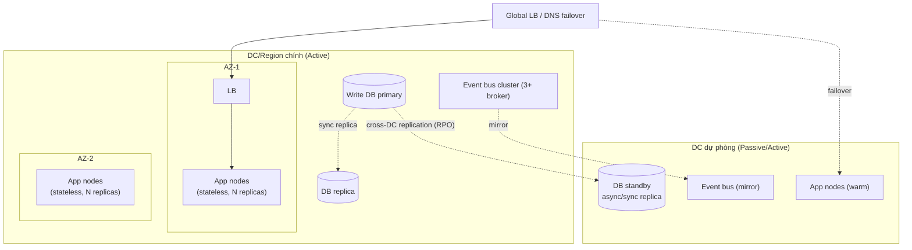

# 07 — Availability, Scalability & Resilience Tactics

> Chi tiết hóa **NT-2 (Sẵn sàng & chống chịu)** và **NT-3 (Mở rộng & hiệu năng)**: biến các NFR định lượng
> ở [`02`](02_nfr-quantified.md) thành **chiến thuật kiến trúc cụ thể + topology + kế hoạch kiểm chứng**.
> Trace: **REQ-N-001..008** · giải xung đột **X2** · fitness **FIT-001..008**. Đầu vào chính cho **Gate G5**.

---

## 1. Bản đồ chiến thuật (tactic map) theo thuộc tính

| Thuộc tính | REQ | Chiến thuật kiến trúc | Fitness |
|-----------|-----|-----------------------|:-------:|
| **Availability** | N-001 | No-SPOF, redundancy, health check + auto-restart, multi-AZ | FIT-001,002 |
| **Recoverability** | N-004 | Backup + DR site + replay event store; RPO/RTO drill | FIT-005 |
| **Scalability** | N-006 | Stateless + horizontal autoscale + LB; broker đệm đỉnh tải | FIT-006,007 |
| **Performance** | N-002,003 | Multi-level cache, read replica, CQRS read model, async | FIT-003,004 |
| **Resilience** | N-007 | Circuit breaker, bulkhead, timeout+retry, graceful degradation | FIT-008 |
| **Elastic data** | N-008 | Sharding, read replica, cache invalidation qua event | FIT-003 |

---

## 2. Topology High Availability

### 2.1 Mô hình triển khai (Proposed — chốt theo cấp độ NĐ 85 tại G1)

### 2.2 Lựa chọn active-active vs active-passive

| Bối cảnh | Mô hình | Lý do |
|----------|---------|-------|
| Hệ thống độ mật cao / air-gap (REQ-S-011) | **Active-Passive** (DR site warm) | Giảm bề mặt tấn công, kiểm soát chặt |
| Tải cao, cần tận dụng cả 2 DC | **Active-Active** | Chia tải, RTO gần 0 |

> Quyết định cuối phụ thuộc **cấp độ NĐ 85/2016** (chốt G1). Tài liệu này chuẩn bị cả 2 kịch bản.

---

## 3. No Single Point of Failure — checklist (FIT-002)

| Tầng | Rủi ro SPOF | Loại bỏ bằng |
|------|-------------|--------------|
| Edge/LB | 1 LB chết | LB cụm + health check + DNS failover |
| App (PH-4) | 1 node chết | Stateless + ≥2 replica/AZ + autoscale |
| Event bus (PH-6) | broker chết | Cluster ≥3 broker, replication factor ≥3 |
| Write DB (PH-7) | primary chết | Replica + auto-failover (leader election) |
| Workflow engine (PH-5) | engine chết | Engine cluster + engine state ở store bền; async → không chặn user |
| IAM (PH-3) | IAM chết | Cụm IAM + token cache TTL ngắn (degrade có kiểm soát) |
| Secret/Key vault | vault chết | Vault HA + cache khóa ngắn hạn |

> Fitness **FIT-002** quét IaC + topology để phát hiện thành phần thiếu redundancy → **block merge**.

---

## 4. Resilience patterns (REQ-N-007) — cô lập lỗi, chống lan dây chuyền

| Pattern | Áp dụng ở đâu | Cấu hình mẫu (Proposed) |
|---------|---------------|-------------------------|
| **Timeout** | Mọi call ra ngoài (DB, engine, interop) | ≤ ngưỡng latency budget §02 |
| **Retry + backoff** | Call idempotent qua bus/interop | exponential + jitter, budget giới hạn |
| **Circuit breaker** | Gọi service/engine hạ nguồn | mở khi lỗi >50%/10s, half-open 30s (FIT-008) |
| **Bulkhead** | Tách pool tài nguyên theo loại tải (WSS fan-out, ghi, đọc) | pool riêng để 1 loại quá tải không kéo sập loại khác |
| **Graceful degradation** | Khi quá tải: hy sinh tính năng phụ | vd tắt gợi ý/analytics, giữ luồng nghiệp vụ lõi |
| **Load shedding** | Gateway (PH-2) | rate limit + từ chối sớm khi quá ngưỡng (TM-009) |

> **Kết hợp với async (ADR-003):** message broker là "bể giảm chấn" — đỉnh tải được đệm ở bus thay vì
> dội thẳng vào service. Đây là tuyến phòng thủ đầu cho REQ-N-002.

---

## 5. Scalability (REQ-N-006, N-008)

| Kỹ thuật | Cơ chế | Ràng buộc |
|----------|--------|-----------|
| **Stateless services** | Không giữ session in-memory → nhân bản tùy ý | FIT-007 block nếu phát hiện state phiên |
| **Horizontal autoscale** | Scale-out theo CPU/queue depth/latency | phản ứng ≤2 phút (FIT-006) |
| **Load balancing** | LB tầng edge + service mesh nội bộ | health-aware |
| **Read scaling** | Read replica + read model CQRS + cache | tách hẳn khỏi đường ghi (ADR-004) |
| **Data scaling** | Sharding theo `tenantId`/đơn vị | khớp mô hình phân tán (ADR-009,010) |
| **Consumer scaling** | Partition bus theo `aggregateId` | giữ thứ tự trong aggregate |

---

## 6. Disaster Recovery (REQ-N-004)

| Hạng mục | Mục tiêu (Proposed) | Cơ chế |
|----------|---------------------|--------|
| **RPO** | ≤ 1 phút (domain ES ≈ 0) | DB replication + event store replay + backup định kỳ |
| **RTO** | ≤ 30 phút | DR site warm + runbook tự động hóa + IaC tái dựng |
| **Backup** | Định kỳ + kiểm thử phục hồi | 3-2-1, mã hóa, trong biên giới (REQ-S-011) |
| **DR drill** | Hàng quý, **thật không giấy** | Game-day, đo RPO/RTO thực tế (FIT-005) |

**Vai trò event store trong DR:** với domain Event Sourcing, replay chuỗi event tái dựng read model & state
→ mất dữ liệu tiệm cận 0. Đây là lý do ES được chọn cho domain trọng yếu ([`06` §4](06_data-architecture.md)).

---

## 7. Chaos Engineering (REQ-N-007) — kiểm chứng chống chịu

| Thử nghiệm | Giả thuyết cần chứng minh | Fitness |
|-----------|---------------------------|:-------:|
| Kill 1 app node | Request tự chuyển node khác, 0 lỗi người dùng | FIT-002 |
| Kill 1 AZ | Hệ thống tiếp tục phục vụ từ AZ còn lại | FIT-002 |
| Inject latency vào 1 service hạ nguồn | Circuit breaker mở, degrade có kiểm soát | FIT-008 |
| Ngắt event bus tạm thời | Outbox giữ event, phục hồi không mất dữ liệu | — |
| Ngắt engine (PH-5) | User không bị chặn (async); task phục hồi khi engine trở lại | — |
| Full DC failover | Đạt RTO/RPO cam kết | FIT-005 |

> **Nguyên tắc:** giả thuyết trước, gây lỗi có kiểm soát trong môi trường thật (staging/prod-like), đo lường,
> sửa. Chaos là **định kỳ** (M5 tổng lực → M8 duy trì), không phải một lần.

---

## 8. Giám sát năng lực (gắn NT-5 / PH-8)

| Tín hiệu | Ngưỡng cảnh báo | Hành động |
|----------|-----------------|-----------|
| Projection lag (CQRS) | vượt latency budget | scale projector / điều tra |
| Queue depth (bus) | tăng liên tục | autoscale consumer |
| Circuit breaker open | bất kỳ | alert SOC + điều tra service hạ nguồn |
| Error budget (SLO) | cạn | freeze release (gắn DevSecOps [`09`](09_devsecops-and-delivery.md)) |

---

## 9. Truy vết mục 07

| Chiến thuật | REQ | Xung đột | Fitness | Gate |
|-------------|-----|----------|---------|------|
| No-SPOF / multi-AZ | N-001,005 | — | FIT-002 | G5 |
| DR / RPO-RTO | N-004 | — | FIT-005 | G5 |
| Autoscale / stateless | N-006 | — | FIT-006,007 | G5 |
| Cache/replica/shard | N-008,002 | — | FIT-003 | G5 |
| Circuit breaker/bulkhead | N-007 | — | FIT-008 | G5 |
| Async đệm đỉnh tải | N-002 | X2 (eventual) | FIT-003 | G5 |
