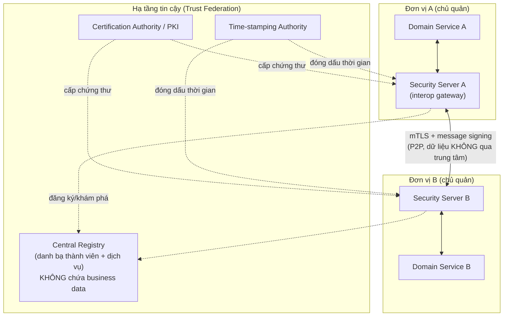
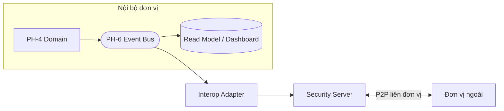

# 08 — Interoperability Layer (Liên thông kiểu X-Road cho bối cảnh Việt Nam)

> Chi tiết hóa PH-6 (phần interoperability) của reference architecture — bước tiếp theo (b) mà tài liệu gốc
> gợi ý: *"thiết kế tầng interoperability PH-6 kiểu X-Road cho bối cảnh Việt Nam"*.
> Hiện thực **ADR-009** (liên thông phi tập trung) và **REQ-F-009, F-010** · **REQ-S-011** · giải xung đột **X3**.
> Bối cảnh VN: ánh xạ sang **NDXP — Nền tảng tích hợp, chia sẻ dữ liệu quốc gia (trục liên thông)** khi cần liên bộ.

---

## 1. Vì sao X-Road, không phải kho trung tâm

| Yêu cầu | Kho trung tâm | Mô hình X-Road (chọn) |
|---------|---------------|------------------------|
| Dữ liệu do đơn vị chủ quản sở hữu (REQ-F-009) | ❌ gom về 1 nơi | ✅ dữ liệu ở lại đơn vị |
| No SPOF tầng dữ liệu (REQ-N-001) | ❌ SPOF khổng lồ | ✅ P2P phi tập trung |
| Chủ quyền số (REQ-O-006) | ❌ tập quyền | ✅ mỗi đơn vị tự chủ |
| Bảo mật/độ mật (REQ-S-011) | ❌ 1 điểm rò rỉ lớn | ✅ mã hóa 2 chiều, phân tán rủi ro |

> **X-Road** (Estonia, OSS) là chuẩn mực thế giới cho trao đổi dữ liệu chính phủ phi tập trung. Ta **áp dụng
> mô hình kiến trúc** của nó (không nhất thiết phần mềm X-Road nguyên bản — quyết định qua PoC Gate G2).

---

## 2. Kiến trúc tầng liên thông



**Nguyên tắc cốt lõi:** dữ liệu đi **P2P giữa các Security Server**, KHÔNG đi qua registry trung tâm.
Registry chỉ giữ **danh bạ thành viên + mô tả dịch vụ + khóa công khai** — không hề chạm business data
→ registry không phải SPOF về dữ liệu (nếu registry tạm ngừng, các phiên P2P đã thiết lập vẫn chạy).

### 2.1 Security Server (adapter liên thông tại mỗi đơn vị)

| Chức năng | Mô tả | Trace |
|-----------|-------|-------|
| Xác thực thành viên | mTLS + chứng thư từ PKI; chỉ thành viên đăng ký mới gọi được | TM-002, REQ-S-001 |
| Ký & mã hóa message | Chữ ký số + mã hóa end-to-end giữa 2 Security Server | REQ-S-006, TM-003 |
| Access control liên đơn vị | Chính sách "đơn vị nào được gọi dịch vụ nào" | REQ-S-002 |
| Ghi log giao dịch bất biến | Mọi trao đổi để lại dấu vết (bằng chứng + không chối bỏ) | REQ-S-008, TM-005 |
| Time-stamping | Đóng dấu thời gian đáng tin cho message | REQ-S-008 |
| Đệm & định tuyến | Che giấu topology nội bộ đơn vị khỏi bên ngoài | REQ-S-011 |

> Security Server chính là **Anti-Corruption Layer ở tầng liên tổ chức**: nội bộ đơn vị (BC, schema riêng)
> không rò rỉ ra ngoài; bên ngoài chỉ thấy hợp đồng dịch vụ chuẩn hóa.

---

## 3. Once-Only Principle (REQ-F-010)

> Đối tượng cung cấp một thông tin **một lần**; hệ thống khác **truy vấn lại** thay vì bắt nhập lại.

```mermaid
sequenceDiagram
  participant Off as Cán bộ (đơn vị A)
  participant A as Service A + SS-A
  participant B as SS-B + Service B (đơn vị chủ quản dữ liệu X)
  Off->>A: cần thông tin X của công dân
  A->>B: query X (mTLS + signed, có lý do truy cập)
  B->>B: kiểm authZ liên đơn vị + độ mật + ghi audit
  B-->>A: trả X (chỉ field được phép) + dấu thời gian
  A-->>Off: hiển thị (không nhập lại, không sao chép lưu trữ dư thừa)
```

| Ràng buộc once-only | Cơ chế |
|---------------------|--------|
| Không nhập trùng | Truy vấn nguồn chủ quản theo nhu cầu |
| Không sao chép dư thừa | Ưu tiên tham chiếu (query-on-demand); cache có TTL + độ mật kiểm soát |
| Minh bạch truy cập | Mọi truy vấn có lý do + audit ở cả 2 phía (chủ quản thấy ai đã đọc dữ liệu mình) |

---

## 4. Federation (REQ-F-010) — mở rộng liên ngành/liên vùng

Khi cần nối hệ sinh thái An ninh Nội địa với hệ sinh thái khác (liên bộ, liên vùng):

| Mức | Cơ chế | Ghi chú |
|-----|--------|---------|
| **Trong ngành** | 1 trust federation (1 registry + PKI dùng chung) | Các đơn vị an ninh |
| **Liên ngành (NDXP)** | Federation 2 registry: bắc cầu tin cậy qua trục quốc gia | Ánh xạ sang trục LGSP/NDXP của VN |
| **Kiểm soát biên** | Chính sách lọc theo độ mật: dữ liệu MẬT **không** federation ra ngoài | REQ-S-011, air-gap |

> **Chủ quyền số (REQ-O-006):** federation là *tùy chọn có kiểm soát*, không bắt buộc gắn cứng. Dữ liệu
> độ mật cao vẫn nằm trong biên giới/air-gap; chỉ dịch vụ được phân loại phù hợp mới tham gia federation.

---

## 5. Hợp đồng dịch vụ liên thông (Service Contract)

Chuẩn hóa để "khả chuyển" (giống cách PH-5 chuẩn hóa BPMN):

```text
InteropService:
  serviceId      : string          # định danh dịch vụ trong registry (vd "an-ninh.hoso.query.v1")
  provider       : MemberId        # đơn vị chủ quản
  classification : PUBLIC | NOI_BO | HAN_CHE | MAT   # độ mật (lái access control liên đơn vị)
  schema         : versioned       # schema request/response (tương thích ngược — REQ-O-004)
  slo            : { latency, availability }
  accessPolicy   : [ allowedMember + purpose ]       # ai được gọi, vì mục đích gì
```

| Nguyên tắc hợp đồng | Trace |
|---------------------|-------|
| Schema versioned, tương thích ngược | REQ-O-004 |
| Độ mật gắn vào dịch vụ (kiểm soát federation) | REQ-S-009,011 |
| Access policy khai báo tường minh (least-privilege liên đơn vị) | REQ-S-002 |

---

## 6. Ghép liên thông với kiến trúc nội bộ (PH-6 event bus ↔ interop)



- **Trong đơn vị:** async event bus (ADR-003).
- **Giữa đơn vị:** P2P qua Security Server (ADR-009).
- **Tổng hợp toàn cục (giải X3):** dữ liệu liên đơn vị chảy qua interop → event → **read model dashboard**;
  dữ liệu gốc vẫn ở đơn vị chủ quản. Không có kho trung tâm nào, dashboard vẫn realtime.

---

## 7. Bảo mật liên thông (bổ sung threat model §05)

| Threat (từ §05) | Áp dụng interop | Kiểm soát |
|-----------------|-----------------|-----------|
| TM-002 Spoofing đơn vị ngoài | Security Server mTLS + PKI + allowlist thành viên | ✅ |
| TM-003 Tampering message | Chữ ký số + mã hóa E2E + time-stamp | ✅ |
| TM-005 Repudiation | Audit bất biến 2 phía (provider thấy ai đã đọc) | ✅ |
| TM-006 Info disclosure ra ngoài biên giới | Phân loại độ mật lái federation + air-gap cho MẬT | ✅ |

---

## 8. Lộ trình triển khai liên thông (khớp milestone)

| Milestone | Việc interop |
|-----------|--------------|
| M2 | PoC 1 dịch vụ liên thông (spike X-Road-style) — đánh giá X-Road OSS vs tự xây |
| M3 | Interop adapter trong walking skeleton (1 luồng query liên đơn vị giả lập) |
| M4 | Interop gia tăng theo domain: once-only cho các dịch vụ thực; access policy |
| M6 | Kiểm định bảo mật liên thông (pentest kênh P2P, xác minh không rò rỉ độ mật) |
| M8 | Federation liên ngành (NDXP) khi có nhu cầu; đánh giá lại chủ quyền |

---

## 9. Truy vết mục 08

| Thành phần | REQ | ADR | Xung đột | Threat |
|-----------|-----|-----|----------|--------|
| X-Road-style P2P, no kho TT | F-009 | 009 | X3 | TM-006 |
| Security Server (interop gateway) | S-001,006,008 | 009 | — | TM-002,003,005 |
| Once-only principle | F-010 | 009 | — | — |
| Federation (NDXP) có kiểm soát | F-010, O-006 | 009 | — | TM-006 |
| Service contract versioned | O-004, S-009 | — | — | — |
