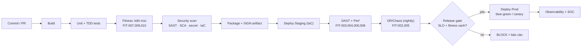

# 09 — DevSecOps, Delivery Pipeline & Fitness Functions

> Chi tiết hóa **NT-4 (DevSecOps & nền tảng vận hành)** và biến **fitness functions** ([`02` §3](02_nfr-quantified.md))
> thành pipeline cụ thể. Đây là cơ chế *thực thi cơ học* các quyết định kiến trúc — không phải review thủ công.
> Trace: **REQ-O-001..006, O-008** · **REQ-S-006,007** · **FIT-001..010**. Đầu vào cho **Gate G3** (pipeline xanh).

---

## 1. Nguyên tắc delivery

| # | Nguyên tắc | Hiện thực | Trace |
|---|-----------|-----------|-------|
| DV1 | **Shift-left security** | Quét bảo mật *trong* pipeline, không để cuối | REQ-O-001 |
| DV2 | **Everything as code** | IaC + policy-as-code + pipeline-as-code | REQ-O-003 |
| DV3 | **Không gián đoạn** | Blue-green/canary + rollback tự động | REQ-O-002 |
| DV4 | **Kiến trúc được test tự động** | Fitness functions là cổng chặn merge/release | REQ-O-008 |
| DV5 | **Tương thích ngược** | Contract test + API versioning gate | REQ-O-004 |
| DV6 | **Chủ quyền số** | Artifact ký số, dependency kiểm soát, air-gap registry | REQ-O-006, REQ-S-011 |

---

## 2. Pipeline CI/CD (các stage + cổng)

### 2.1 Cổng chặn (gate) theo stage

| Stage | Kiểm tra | Fail → | Trace |
|-------|----------|--------|-------|
| Unit/TDD | Test liên quan xanh (pipeline dự án CLAUDE.md Phase 3) | block merge | — |
| **Arch fitness** | FIT-007 (coupling/stateless/no-engine-import), FIT-009 (trace), FIT-010 (engine-swap contract) | **block merge** | REQ-F-002,003,004 · N-009 |
| Security scan | SAST + SCA (dependency/CVE) + secret scan + IaC misconfig | block merge nếu nghiêm trọng | REQ-O-001, REQ-S-007, TM-012 |
| Perf/DAST | FIT-003,004,006,008 trên staging | block release | REQ-N-002,003,006,007 |
| DR/Chaos | FIT-002,005 (nightly/định kỳ) | escalate ARB | REQ-N-001,004 |
| Release gate | SLO error budget còn + mọi fitness xanh | block release | REQ-O-008 |

> **Điểm mấu chốt:** FIT-007 và FIT-010 chặn merge cơ học — không ai có thể vô tình để domain import engine SDK
> hoặc phá "tháo lắp được". Đây là cách kiến trúc **tự bảo vệ** thay vì dựa vào kỷ luật con người.

---

## 3. Security trong pipeline (DevSecOps — REQ-O-001)

| Loại quét | Công cụ (Proposed) | Bắt gì | Threat |
|-----------|--------------------|--------|--------|
| **SAST** | static analyzer theo ngôn ngữ | lỗ hổng code, injection | TM-003,010 |
| **SCA** | dependency scanner | CVE thư viện, license | TM-012 |
| **Secret scan** | pre-commit + CI | khóa/secret hardcode | REQ-S-007, TM-012 |
| **IaC scan** | policy-as-code | misconfig hạ tầng (open port, thiếu mã hóa, thiếu redundancy) | REQ-S-006, FIT-002 |
| **Artifact signing** | ký + verify khi deploy | chống chèn artifact giả (supply chain) | TM-012 |
| **DAST** | scanner động trên staging | lỗ hổng runtime | TM-003,009 |

> Kết nối `06`/`05`: secret management tập trung (REQ-S-007) nghĩa là **pipeline không bao giờ chứa secret thô** —
> chỉ tham chiếu vault. Secret scan chặn vi phạm ngay tại commit.

---

## 4. Chiến lược triển khai không gián đoạn (REQ-O-002)

| Kỹ thuật | Khi nào | Rollback |
|----------|---------|----------|
| **Blue-green** | Release lớn / thay đổi schema | Chuyển traffic về blue tức thì |
| **Canary** | Thay đổi rủi ro trung bình | Mở dần %; auto-rollback khi SLO/error tăng |
| **Feature flag** | Bật/tắt tính năng độc lập deploy | Tắt flag không cần redeploy |
| **Expand-contract migration** | Thay đổi DB schema | 2 pha tương thích ngược, không downtime |

**Ràng buộc schema (khớp ADR-004,010):** migration DB dùng **expand-contract** (thêm cột/bảng mới tương thích
→ chuyển đổi → gỡ cũ) để không phá read model đang chạy và giữ API versioning tương thích ngược (REQ-O-004).

---

## 5. Môi trường & IaC (REQ-O-003)

| Môi trường | Mục đích | Đặc thù |
|-----------|----------|---------|
| dev | Phát triển | dữ liệu giả, quét bảo mật cơ bản |
| test/CI | Tự động hóa | ephemeral, dựng từ IaC mỗi lần |
| staging | Prod-like | nơi chạy perf/DAST/chaos (FIT-003..008) |
| prod | Vận hành | multi-AZ/DC, air-gap tùy cấp độ (REQ-S-011) |

- **IaC** định nghĩa toàn bộ hạ tầng → tái lập được, versioned, review như code.
- **Config theo môi trường** — không hardcode; secret qua vault (REQ-S-007).
- **Air-gap registry:** với hệ độ mật cao, dependency/artifact mirror nội bộ (chủ quyền số REQ-O-006).

---

## 6. Fitness Functions — vị trí thực thi (tổng hợp)

| Fitness | Kiểm gì | Chạy ở stage | Fail → |
|---------|---------|--------------|--------|
| FIT-001 | Uptime probe | runtime | alert |
| FIT-002 | No-SPOF (IaC+topology) | arch + nightly | block merge |
| FIT-003 | Throughput/RPS | perf (staging) | block release |
| FIT-004 | Latency budget | perf | block release |
| FIT-005 | DR RPO/RTO | game-day định kỳ | escalate |
| FIT-006 | Autoscale phản ứng | chaos/load | warn |
| FIT-007 | **Coupling/stateless/no-engine-import** | arch (PR) | **block merge** |
| FIT-008 | Circuit breaker/bulkhead | chaos | warn |
| FIT-009 | Trace propagation 100% | arch (PR) | block merge |
| FIT-010 | **Engine-swap contract ≥2 adapter** | pre-release | block release |

---

## 7. Quản trị nợ kỹ thuật (REQ-O-008)

| Cơ chế | Nội dung | Tần suất |
|--------|----------|----------|
| Debt threshold trong fitness | Ngưỡng coupling/complexity/coverage; vượt → warn/block | mỗi commit |
| Kiểm toán kiến trúc | ARB rà soát drift so với ADR | định kỳ (M8) |
| ADR review | ADR cũ còn đúng? Cần `Superseded`? | theo gate |
| Dependency freshness | CVE + version lock | CI liên tục |

---

## 8. Ánh xạ pipeline ↔ Milestone

| Milestone | Trạng thái pipeline |
|-----------|---------------------|
| M2 | Fitness functions **v1** định nghĩa (khung) |
| M3 | Pipeline CI/CD + DevSecOps **vận hành**, IaC, walking skeleton chạy qua pipeline → **Gate G3** |
| M4 | SAST/DAST mỗi increment; contract test (FIT-010) mở rộng theo adapter/domain |
| M5 | Perf/chaos/DR tổng lực (FIT-003..008) → Gate G5 |
| M6 | Pentest bên thứ 3 tích hợp báo cáo; ký artifact bắt buộc |
| M7 | Blue-green/canary go-live thật |
| M8 | Engine-swap drill (FIT-010) + kiểm toán nợ kỹ thuật định kỳ |

---

## 9. Truy vết mục 09

| Thành phần | REQ | Threat | Fitness | Gate |
|-----------|-----|--------|---------|------|
| CI/CD + DevSecOps scan | O-001 | TM-012 | FIT-002,009 | G3 |
| Blue-green/canary | O-002 | — | — | G7 |
| IaC + môi trường | O-003 | TM-012 | FIT-002 | G3 |
| API versioning / expand-contract | O-004 | — | contract test | G4 |
| Artifact signing / air-gap registry | O-006, S-011 | TM-012 | — | G6 |
| Debt threshold + kiểm toán | O-008 | — | debt fitness | G8 |
| Arch fitness (bảo vệ ADR-001/002) | F-002,003 · N-006 | — | FIT-007,010 | G3+ |
